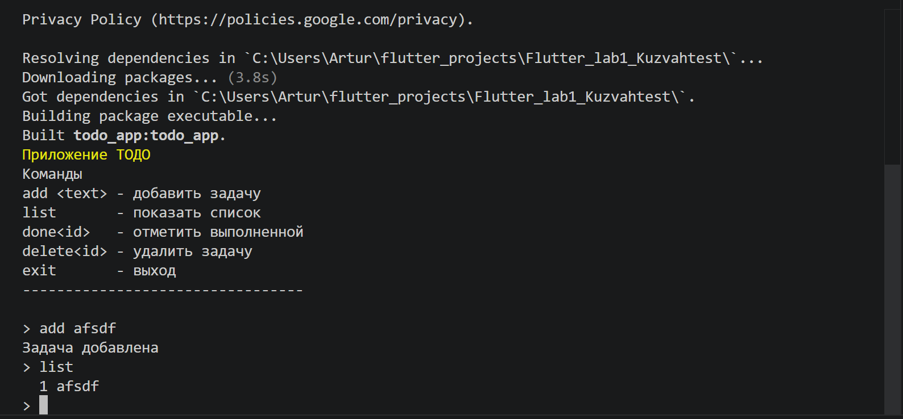
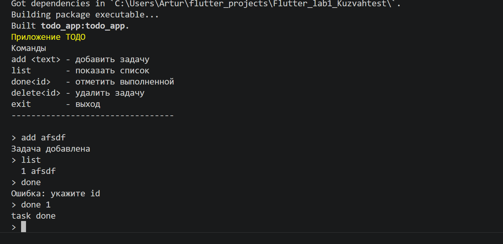

# Лабораторная 1
## TOdo- приложение.
В нем можно вести список задач, удалять и править его.

## Авторы: Вахрушева Алина Кузнецов Артур ИСП-233





## Как запустить:

Для того чтобы запустить программу вам нужно всего лишь склонировать репозиторий себе в папку

```
git clone https:...(ссылка на этот репозиторий)
```

в терминале пропишите 

```
dart run
```

## Что изучили:
-Знакомство с Dart
-Знакомство с Flutter
-dynamic


## Ответы на вопросы:

1) final можно задать один раз но значение может появиться во время работы программы const это полностью фиксированное значение которое известно сразу

2) String это просто текст

3) Future это значение которое появится позже await ждет пока оно появится но программа при этом не зависает полностью

4) именованные конструкторы нужны потому что в Dart нельзя делать несколько одинаковых конструкторов как в C S поэтому делают разные с именами
